# HỆ THỐNG QUẢN LÝ TRƯỜNG HỌC (SCHOOL MANAGEMENT SYSTEM)
## BỘ ĐẶC TẢ SƠ ĐỒ CHUẨN (USE CASE, ACTIVITY, USER FLOW, STATE, SEQUENCE) THEO TỪNG CHỨC NĂNG

---

# MỤC LỤC CÁC CHỨC NĂNG

- [Chức năng 1: Xác thực & Phân quyền (Authentication & RBAC)](#chức-năng-1-xác-thực--phân-quyền-authentication--rbac)
- [Chức năng 2: Quản lý Người dùng, Học sinh & Giáo viên (User Management)](#chức-năng-2-quản-lý-người-dùng-học-sinh--giáo-viên)
- [Chức năng 3: Quản lý Năm học, Học kỳ, Lớp & Phòng học (Academic Structure)](#chức-năng-3-quản-lý-năm-học-học-kỳ-lớp--phòng-học)
- [Chức năng 4: Xếp Thời Khóa Biểu Tự Động & Thủ Công (Timetable System)](#chức-năng-4-xếp-thời-khóa-biểu-tự-động--thủ-công)
- [Chức năng 5: Điểm danh & Giám sát Chuyên cần (Attendance Management)](#chức-năng-5-điểm-danh--giám-sát-chuyên-cần)
- [Chức năng 6: Sổ Điểm & Quản lý Điểm Số (Gradebook & Assessment)](#chức-năng-6-sổ-điểm--quản-lý-điểm-số)
- [Chức năng 7: Đánh giá Cuối năm & Xét Lên Lớp (Promotion Evaluation)](#chức-năng-7-đánh-giá-cuối-năm--xét-lên-lớp)
- [Chức năng 8: Chuyển Giao Năm Học & Phân Lớp Mới (Year Transition Wizard)](#chức-năng-8-chuyển-giao-năm-học--phân-lớp-mới)
- [Chức năng 9: Thông báo & Nhật ký Kiểm toán Bảo mật (Audit Logs & Notifications)](#chức-năng-9-thông-báo--nhật-ký-kiểm-toán-bảo-mật)

---

# Chức năng 1: Xác thực & Phân quyền (Authentication & RBAC)

### 1.1. Use Case Diagram (Có những chức năng nào?)
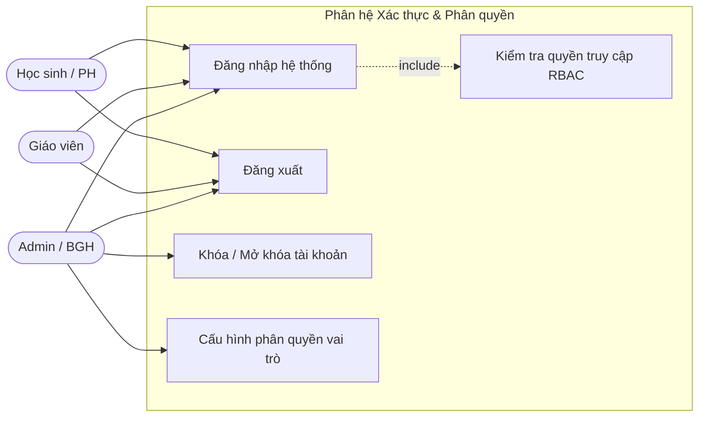
```mermaid
flowchart LR
    Admin([Admin / BGH])
    Teacher([Giáo viên])
    Student([Học sinh / PH])
    
    subgraph AuthSystem ["Phân hệ Xác thực & Phân quyền"]
        UC1[Đăng nhập hệ thống]
        UC2[Đăng xuất]
        UC3[Kiểm tra quyền truy cập RBAC]
        UC4[Khóa / Mở khóa tài khoản]
        UC5[Cấu hình phân quyền vai trò]
    end
    
    Student --> UC1
    Student --> UC2
    Teacher --> UC1
    Teacher --> UC2
    Admin --> UC1
    Admin --> UC2
    Admin --> UC4
    Admin --> UC5
    
    UC1 -.->|include| UC3
```

### 1.2. Activity Diagram (Workflow nghiệp vụ diễn ra thế nào?)
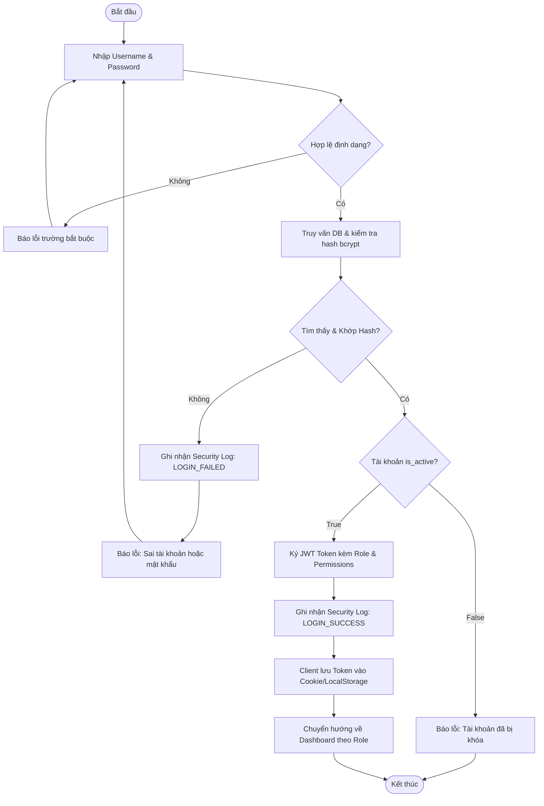
```mermaid
flowchart TD
    Start([Bắt đầu]) --> Input[Nhập Username & Password]
    Input --> ValidateFormat{Hợp lệ định dạng?}
    ValidateFormat -- Không --> ShowFormatErr[Báo lỗi trường bắt buộc]
    ShowFormatErr --> Input
    
    ValidateFormat -- Có --> QueryDB[Truy vấn DB & kiểm tra hash bcrypt]
    QueryDB --> CheckExist{Tìm thấy & Khớp Hash?}
    CheckExist -- Không --> LogFail[Ghi nhận Security Log: LOGIN_FAILED]
    LogFail --> ShowAuthErr[Báo lỗi: Sai tài khoản hoặc mật khẩu]
    ShowAuthErr --> Input
    
    CheckExist -- Có --> CheckActive{Tài khoản is_active?}
    CheckActive -- False --> ShowLockedErr[Báo lỗi: Tài khoản đã bị khóa]
    ShowLockedErr --> EndAuth([Kết thúc])
    
    CheckActive -- True --> SignJWT[Ký JWT Token kèm Role & Permissions]
    SignJWT --> LogSuccess[Ghi nhận Security Log: LOGIN_SUCCESS]
    LogSuccess --> SaveSession[Client lưu Token vào Cookie/LocalStorage]
    SaveSession --> RedirectDash[Chuyển hướng về Dashboard theo Role]
    RedirectDash --> EndAuth
```

### 1.3. User Flow / Screen Flow (User đi qua các màn hình như thế nào?)
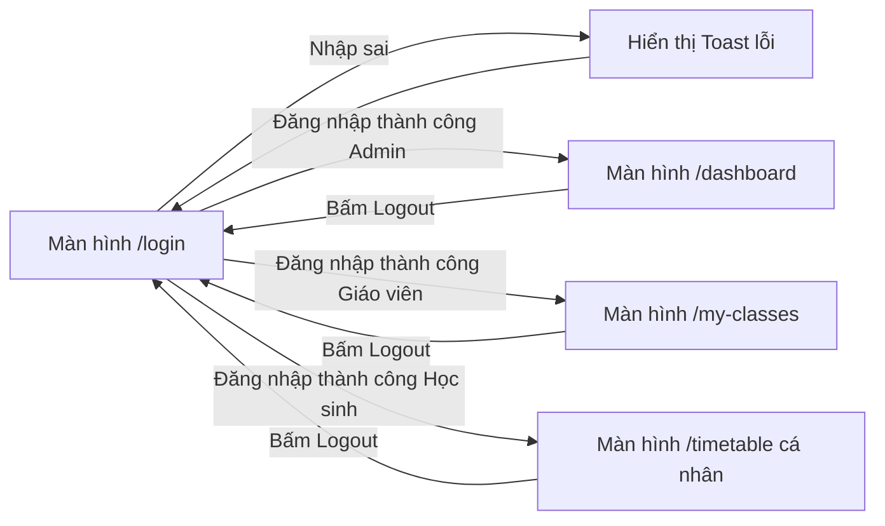
```mermaid
flowchart LR
    S_Login[Màn hình /login] -->|Nhập sai| S_Login_Err[Hiển thị Toast lỗi]
    S_Login_Err --> S_Login
    S_Login -->|Đăng nhập thành công Admin| S_AdminDash[Màn hình /dashboard]
    S_Login -->|Đăng nhập thành công Giáo viên| S_TeacherDash[Màn hình /my-classes]
    S_Login -->|Đăng nhập thành công Học sinh| S_StudentDash[Màn hình /timetable cá nhân]
    
    S_AdminDash -->|Bấm Logout| S_Login
    S_TeacherDash -->|Bấm Logout| S_Login
    S_StudentDash -->|Bấm Logout| S_Login
```

### 1.4. State Diagram (Trạng thái Data/Object thay đổi thế nào?)
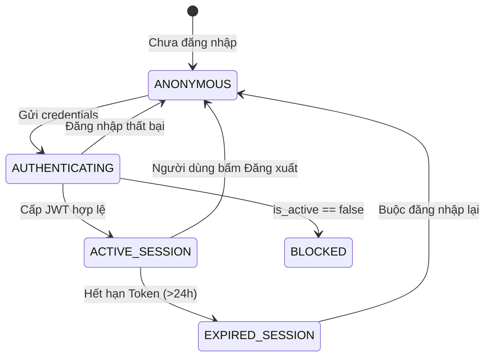
```mermaid
stateDiagram-v2
    [*] --> ANONYMOUS: Chưa đăng nhập
    ANONYMOUS --> AUTHENTICATING: Gửi credentials
    AUTHENTICATING --> ANONYMOUS: Đăng nhập thất bại
    AUTHENTICATING --> ACTIVE_SESSION: Cấp JWT hợp lệ
    AUTHENTICATING --> BLOCKED: is_active == false
    ACTIVE_SESSION --> EXPIRED_SESSION: Hết hạn Token (>24h)
    EXPIRED_SESSION --> ANONYMOUS: Buộc đăng nhập lại
    ACTIVE_SESSION --> ANONYMOUS: Người dùng bấm Đăng xuất
```

### 1.5. Sequence Diagram (FE $\leftrightarrow$ BE $\leftrightarrow$ DB tương tác thế nào?)
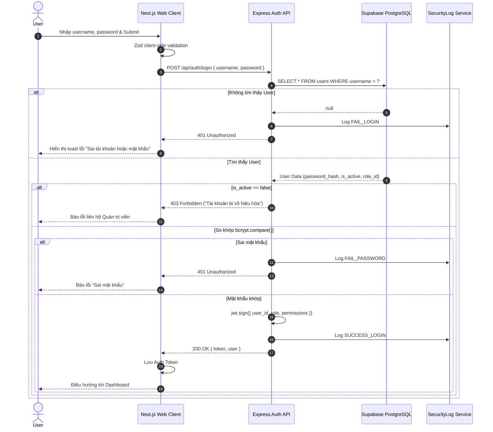
```mermaid
sequenceDiagram
    autonumber
    actor User
    participant Client as Next.js Web Client
    participant API as Express Auth API
    participant DB as Supabase PostgreSQL
    participant Sec as SecurityLog Service

    User->>Client: Nhập username, password & Submit
    Client->>Client: Zod client-side validation
    Client->>API: POST /api/auth/login { username, password }
    API->>DB: SELECT * FROM users WHERE username = ?
    alt Không tìm thấy User
        DB-->>API: null
        API->>Sec: Log FAIL_LOGIN
        API-->>Client: 401 Unauthorized
        Client-->>User: Hiển thị toast lỗi "Sai tài khoản hoặc mật khẩu"
    else Tìm thấy User
        DB-->>API: User Data (password_hash, is_active, role_id)
        alt is_active == false
            API-->>Client: 403 Forbidden ("Tài khoản bị vô hiệu hóa")
            Client-->>User: Báo lỗi liên hệ Quản trị viên
        else So khớp bcrypt.compare()
            alt Sai mật khẩu
                API->>Sec: Log FAIL_PASSWORD
                API-->>Client: 401 Unauthorized
                Client-->>User: Báo lỗi "Sai mật khẩu"
            else Mật khẩu khớp
                API->>API: jwt.sign({ user_id, role, permissions })
                API->>Sec: Log SUCCESS_LOGIN
                API-->>Client: 200 OK { token, user }
                Client->>Client: Lưu Auth Token
                Client-->>User: Điều hướng tới Dashboard
            end
        end
    end
```

---

# Chức năng 2: Quản lý Người dùng, Học sinh & Giáo viên

### 2.1. Use Case Diagram
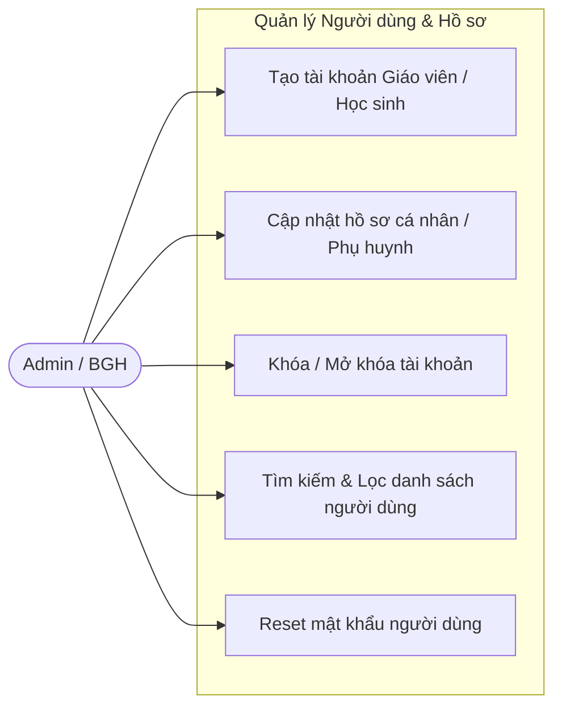
```mermaid
flowchart LR
    Admin([Admin / BGH])
    
    subgraph UserMgmt ["Quản lý Người dùng & Hồ sơ"]
        UC1[Tạo tài khoản Giáo viên / Học sinh]
        UC2[Cập nhật hồ sơ cá nhân / Phụ huynh]
        UC3[Khóa / Mở khóa tài khoản]
        UC4[Tìm kiếm & Lọc danh sách người dùng]
        UC5[Reset mật khẩu người dùng]
    end
    
    Admin --> UC1
    Admin --> UC2
    Admin --> UC3
    Admin --> UC4
    Admin --> UC5
```

### 2.2. Activity Diagram
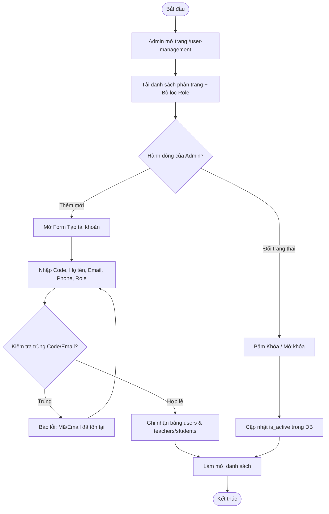
```mermaid
flowchart TD
    Start([Bắt đầu]) --> OpenUserList[Admin mở trang /user-management]
    OpenUserList --> FetchList[Tải danh sách phân trang + Bộ lọc Role]
    FetchList --> AdminChoice{Hành động của Admin?}
    
    AdminChoice -- Thêm mới --> OpenCreateModal[Mở Form Tạo tài khoản]
    OpenCreateModal --> InputForm[Nhập Code, Họ tên, Email, Phone, Role]
    InputForm --> CheckDup{Kiểm tra trùng Code/Email?}
    CheckDup -- Trùng --> ShowDupErr[Báo lỗi: Mã/Email đã tồn tại]
    ShowDupErr --> InputForm
    CheckDup -- Hợp lệ --> CreateUserDB[Ghi nhận bảng users & teachers/students]
    CreateUserDB --> RefreshList[Làm mới danh sách]
    
    AdminChoice -- Đổi trạng thái --> ToggleStatus[Bấm Khóa / Mở khóa]
    ToggleStatus --> UpdateActiveDB[Cập nhật is_active trong DB]
    UpdateActiveDB --> RefreshList
    
    RefreshList --> EndUserMgmt([Kết thúc])
```

### 2.3. User Flow / Screen Flow
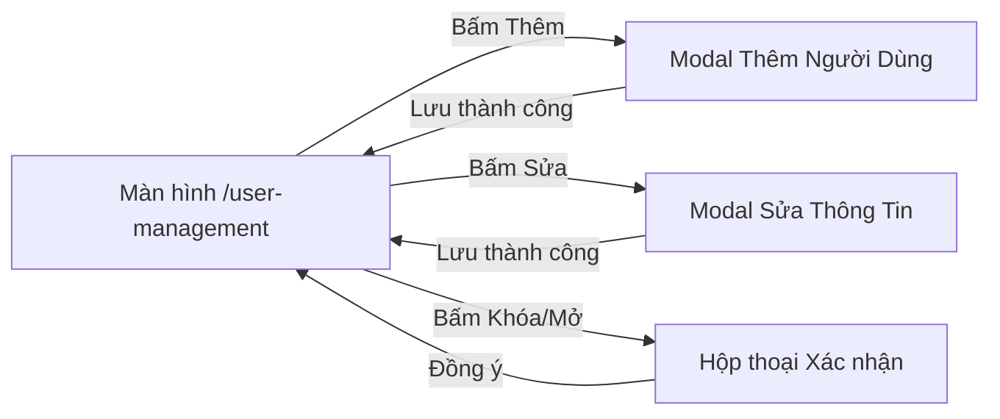
```mermaid
flowchart LR
    S_UserList[Màn hình /user-management] -->|Bấm Thêm| S_CreateModal[Modal Thêm Người Dùng]
    S_CreateModal -->|Lưu thành công| S_UserList
    S_UserList -->|Bấm Sửa| S_EditModal[Modal Sửa Thông Tin]
    S_EditModal -->|Lưu thành công| S_UserList
    S_UserList -->|Bấm Khóa/Mở| S_ConfirmAlert[Hộp thoại Xác nhận]
    S_ConfirmAlert -->|Đồng ý| S_UserList
```

### 2.4. State Diagram
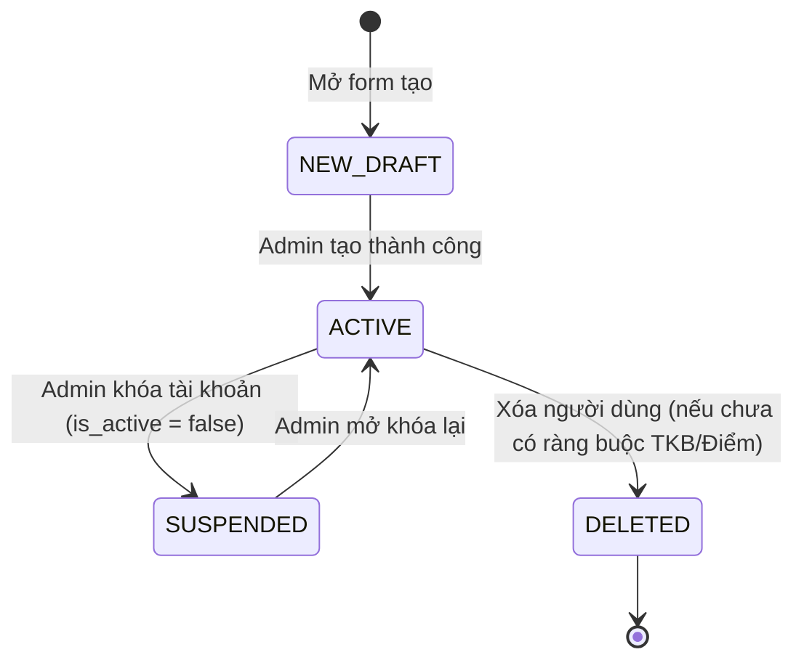
```mermaid
stateDiagram-v2
    [*] --> NEW_DRAFT: Mở form tạo
    NEW_DRAFT --> ACTIVE: Admin tạo thành công
    ACTIVE --> SUSPENDED: Admin khóa tài khoản (is_active = false)
    SUSPENDED --> ACTIVE: Admin mở khóa lại
    ACTIVE --> DELETED: Xóa người dùng (nếu chưa có ràng buộc TKB/Điểm)
    DELETED --> [*]
```

### 2.5. Sequence Diagram
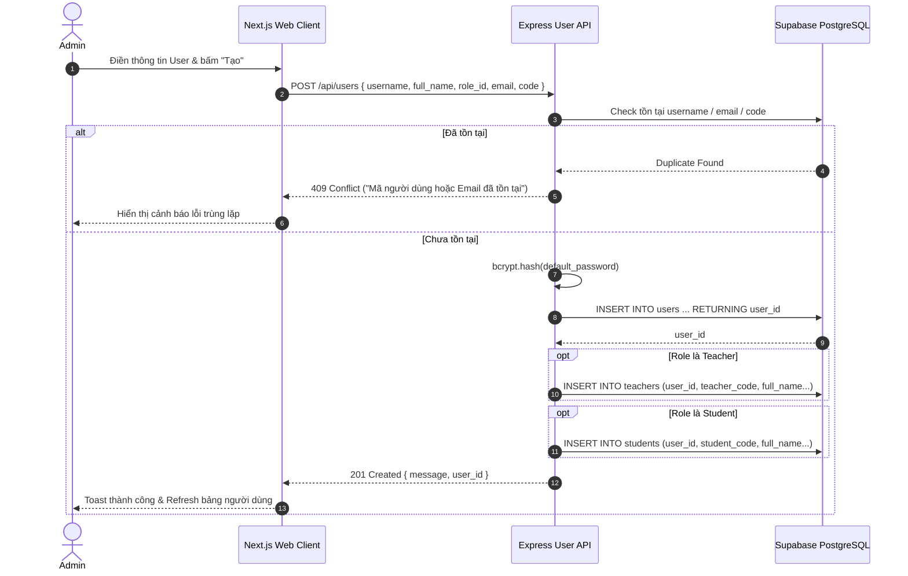
```mermaid
sequenceDiagram
    autonumber
    actor Admin
    participant Client as Next.js Web Client
    participant API as Express User API
    participant DB as Supabase PostgreSQL

    Admin->>Client: Điền thông tin User & bấm "Tạo"
    Client->>API: POST /api/users { username, full_name, role_id, email, code }
    API->>DB: Check tồn tại username / email / code
    alt Đã tồn tại
        DB-->>API: Duplicate Found
        API-->>Client: 409 Conflict ("Mã người dùng hoặc Email đã tồn tại")
        Client-->>Admin: Hiển thị cảnh báo lỗi trùng lặp
    else Chưa tồn tại
        API->>API: bcrypt.hash(default_password)
        API->>DB: INSERT INTO users ... RETURNING user_id
        DB-->>API: user_id
        opt Role là Teacher
            API->>DB: INSERT INTO teachers (user_id, teacher_code, full_name...)
        end
        opt Role là Student
            API->>DB: INSERT INTO students (user_id, student_code, full_name...)
        end
        API-->>Client: 201 Created { message, user_id }
        Client-->>Admin: Toast thành công & Refresh bảng người dùng
    end
```

---

# Chức năng 3: Quản lý Năm học, Học kỳ, Lớp & Phòng học

### 3.1. Use Case Diagram
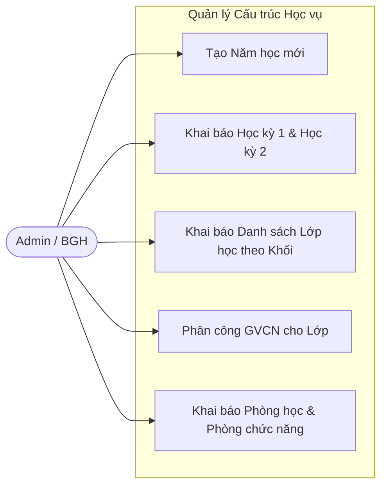
```mermaid
flowchart LR
    Admin([Admin / BGH])
    
    subgraph AcademicMgmt ["Quản lý Cấu trúc Học vụ"]
        UC1[Tạo Năm học mới]
        UC2[Khai báo Học kỳ 1 & Học kỳ 2]
        UC3[Khai báo Danh sách Lớp học theo Khối]
        UC4[Phân công GVCN cho Lớp]
        UC5[Khai báo Phòng học & Phòng chức năng]
    end
    
    Admin --> UC1
    Admin --> UC2
    Admin --> UC3
    Admin --> UC4
    Admin --> UC5
```

### 3.2. Activity Diagram
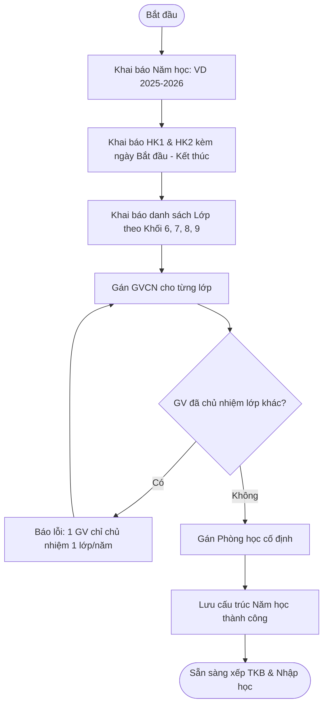
```mermaid
flowchart TD
    Start([Bắt đầu]) --> CreateYear[Khai báo Năm học: VD 2025-2026]
    CreateYear --> CreateSemesters[Khai báo HK1 & HK2 kèm ngày Bắt đầu - Kết thúc]
    CreateSemesters --> CreateClasses[Khai báo danh sách Lớp theo Khối 6, 7, 8, 9]
    CreateClasses --> AssignGVCN[Gán GVCN cho từng lớp]
    AssignGVCN --> CheckTeacherConflict{GV đã chủ nhiệm lớp khác?}
    CheckTeacherConflict -- Có --> ShowGVWarn[Báo lỗi: 1 GV chỉ chủ nhiệm 1 lớp/năm]
    ShowGVWarn --> AssignGVCN
    CheckTeacherConflict -- Không --> AssignRoom[Gán Phòng học cố định]
    AssignRoom --> SaveAcademic[Lưu cấu trúc Năm học thành công]
    SaveAcademic --> EndAcademic([Sẵn sàng xếp TKB & Nhập học])
```

### 3.3. User Flow / Screen Flow
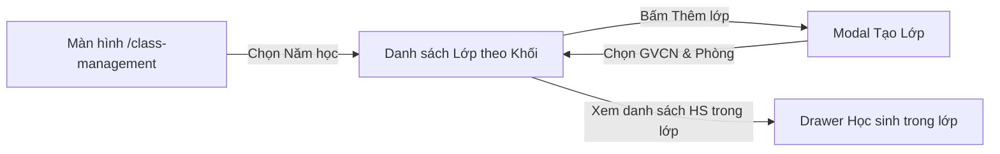
```mermaid
flowchart LR
    S_ClassMgmt[Màn hình /class-management] -->|Chọn Năm học| S_ClassList[Danh sách Lớp theo Khối]
    S_ClassList -->|Bấm Thêm lớp| S_ModalAddClass[Modal Tạo Lớp]
    S_ModalAddClass -->|Chọn GVCN & Phòng| S_ClassList
    S_ClassList -->|Xem danh sách HS trong lớp| S_StudentInClass[Drawer Học sinh trong lớp]
```

### 3.4. State Diagram
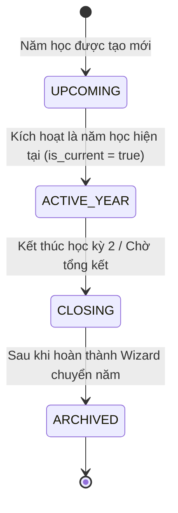
```mermaid
stateDiagram-v2
    [*] --> UPCOMING: Năm học được tạo mới
    UPCOMING --> ACTIVE_YEAR: Kích hoạt là năm học hiện tại (is_current = true)
    ACTIVE_YEAR --> CLOSING: Kết thúc học kỳ 2 / Chờ tổng kết
    CLOSING --> ARCHIVED: Sau khi hoàn thành Wizard chuyển năm
    ARCHIVED --> [*]
```

### 3.5. Sequence Diagram
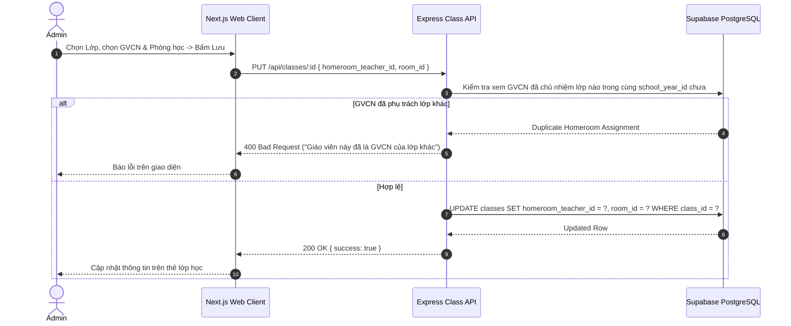
```mermaid
sequenceDiagram
    autonumber
    actor Admin
    participant Client as Next.js Web Client
    participant API as Express Class API
    participant DB as Supabase PostgreSQL

    Admin->>Client: Chọn Lớp, chọn GVCN & Phòng học -> Bấm Lưu
    Client->>API: PUT /api/classes/:id { homeroom_teacher_id, room_id }
    API->>DB: Kiểm tra xem GVCN đã chủ nhiệm lớp nào trong cùng school_year_id chưa
    alt GVCN đã phụ trách lớp khác
        DB-->>API: Duplicate Homeroom Assignment
        API-->>Client: 400 Bad Request ("Giáo viên này đã là GVCN của lớp khác")
        Client-->>Admin: Báo lỗi trên giao diện
    else Hợp lệ
        API->>DB: UPDATE classes SET homeroom_teacher_id = ?, room_id = ? WHERE class_id = ?
        DB-->>API: Updated Row
        API-->>Client: 200 OK { success: true }
        Client-->>Admin: Cập nhật thông tin trên thẻ lớp học
    end
```

---

# Chức năng 4: Xếp Thời Khóa Biểu Tự Động & Thủ Công

### 4.1. Use Case Diagram
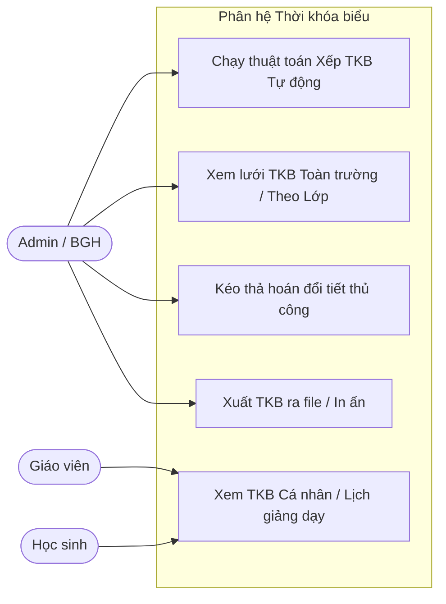
```mermaid
flowchart LR
    Admin([Admin / BGH])
    Teacher([Giáo viên])
    Student([Học sinh])
    
    subgraph TimetableSystem ["Phân hệ Thời khóa biểu"]
        UC1[Chạy thuật toán Xếp TKB Tự động]
        UC2[Xem lưới TKB Toàn trường / Theo Lớp]
        UC3[Kéo thả hoán đổi tiết thủ công]
        UC4[Xem TKB Cá nhân / Lịch giảng dạy]
        UC5[Xuất TKB ra file / In ấn]
    end
    
    Admin --> UC1
    Admin --> UC2
    Admin --> UC3
    Admin --> UC5
    Teacher --> UC4
    Student --> UC4
```

### 4.2. Activity Diagram (Thuật toán Auto-Scheduler)
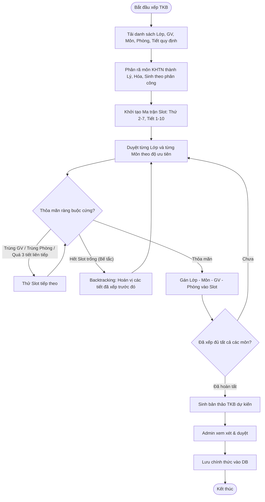
```mermaid
flowchart TD
    Start([Bắt đầu xếp TKB]) --> LoadEntities[Tải danh sách Lớp, GV, Môn, Phòng, Tiết quy định]
    LoadEntities --> SplitKHTN[Phân rã môn KHTN thành Lý, Hóa, Sinh theo phân công]
    SplitKHTN --> InitMatrix[Khởi tạo Ma trận Slot: Thứ 2-7, Tiết 1-10]
    
    InitMatrix --> ScheduleLoop[Duyệt từng Lớp và từng Môn theo độ ưu tiên]
    ScheduleLoop --> CheckHardConstraints{Thỏa mãn ràng buộc cứng?}
    
    CheckHardConstraints -- "Trùng GV / Trùng Phòng / Quá 3 tiết liên tiếp" --> TryNextSlot[Thử Slot tiếp theo]
    TryNextSlot --> CheckHardConstraints
    
    CheckHardConstraints -- "Hết Slot trống (Bế tắc)" --> Backtrack[Backtracking: Hoán vị các tiết đã xếp trước đó]
    Backtrack --> ScheduleLoop
    
    CheckHardConstraints -- "Thỏa mãn" --> AssignSlot[Gán Lớp - Môn - GV - Phòng vào Slot]
    AssignSlot --> CheckAllDone{Đã xếp đủ tất cả các môn?}
    CheckAllDone -- Chưa --> ScheduleLoop
    CheckAllDone -- Đã hoàn tất --> GenerateDraft[Sinh bản thảo TKB dự kiến]
    GenerateDraft --> AdminPreview[Admin xem xét & duyệt]
    AdminPreview --> SaveOfficial[Lưu chính thức vào DB]
    SaveOfficial --> EndTKB([Kết thúc])
```

### 4.3. User Flow / Screen Flow
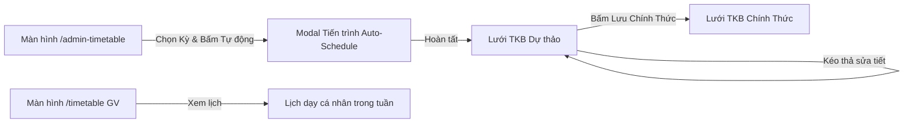
```mermaid
flowchart LR
    S_AdminTKB[Màn hình /admin-timetable] -->|Chọn Kỳ & Bấm Tự động| S_AutoProgress[Modal Tiến trình Auto-Schedule]
    S_AutoProgress -->|Hoàn tất| S_DraftGrid[Lưới TKB Dự thảo]
    S_DraftGrid -->|Kéo thả sửa tiết| S_DraftGrid
    S_DraftGrid -->|Bấm Lưu Chính Thức| S_OfficialGrid[Lưới TKB Chính Thức]
    
    S_TeacherDash[Màn hình /timetable GV] -->|Xem lịch| S_TeacherGrid[Lịch dạy cá nhân trong tuần]
```

### 4.4. State Diagram
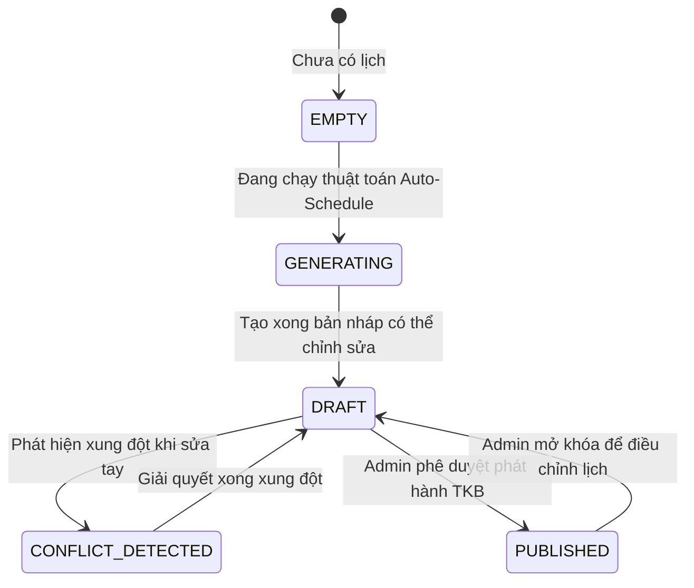
```mermaid
stateDiagram-v2
    [*] --> EMPTY: Chưa có lịch
    EMPTY --> GENERATING: Đang chạy thuật toán Auto-Schedule
    GENERATING --> DRAFT: Tạo xong bản nháp có thể chỉnh sửa
    DRAFT --> CONFLICT_DETECTED: Phát hiện xung đột khi sửa tay
    CONFLICT_DETECTED --> DRAFT: Giải quyết xong xung đột
    DRAFT --> PUBLISHED: Admin phê duyệt phát hành TKB
    PUBLISHED --> DRAFT: Admin mở khóa để điều chỉnh lịch
```

### 4.5. Sequence Diagram
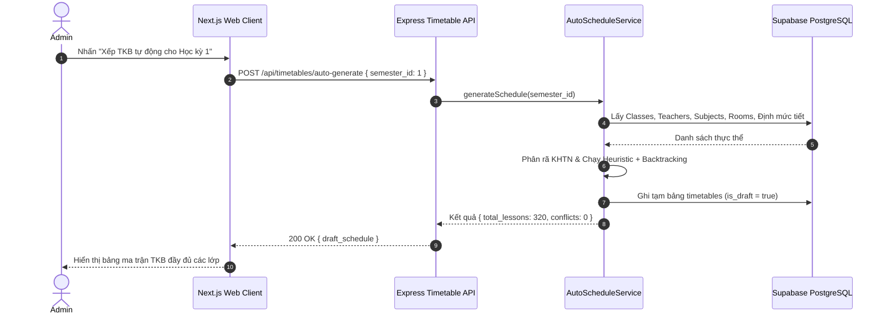
```mermaid
sequenceDiagram
    autonumber
    actor Admin
    participant Client as Next.js Web Client
    participant API as Express Timetable API
    participant AutoService as AutoScheduleService
    participant DB as Supabase PostgreSQL

    Admin->>Client: Nhấn "Xếp TKB tự động cho Học kỳ 1"
    Client->>API: POST /api/timetables/auto-generate { semester_id: 1 }
    API->>AutoService: generateSchedule(semester_id)
    AutoService->>DB: Lấy Classes, Teachers, Subjects, Rooms, Định mức tiết
    DB-->>AutoService: Danh sách thực thể
    AutoService->>AutoService: Phân rã KHTN & Chạy Heuristic + Backtracking
    AutoService->>DB: Ghi tạm bảng timetables (is_draft = true)
    AutoService-->>API: Kết quả { total_lessons: 320, conflicts: 0 }
    API-->>Client: 200 OK { draft_schedule }
    Client-->>Admin: Hiển thị bảng ma trận TKB đầy đủ các lớp
```

---

# Chức năng 5: Điểm danh & Giám sát Chuyên cần

### 5.1. Use Case Diagram
```mermaid
flowchart LR
    Teacher([Giáo viên])
    Admin([Admin / BGH])
    Student([Học sinh / PH])
    
    subgraph AttendanceSystem ["Quản lý Điểm danh & Chuyên cần"]
        UC1[Tạo phiên điểm danh theo ngày/tiết]
        UC2[Đánh dấu trạng thái học sinh]
        UC3[Xem lịch sử chuyên cần cá nhân]
        UC4[Cảnh báo tự động học sinh vắng vượt ngưỡng]
        UC5[Xuất báo cáo chuyên cần toàn trường]
    end
    
    Teacher --> UC1
    Teacher --> UC2
    Student --> UC3
    Admin --> UC4
    Admin --> UC5
```

### 5.2. Activity Diagram
```mermaid
flowchart TD
    Start([Bắt đầu]) --> SelectSession[GV chọn Lớp & Ngày điểm danh]
    SelectSession --> LoadRoster[Tải danh sách học sinh]
    LoadRoster --> MarkStatus[Đánh dấu: Có mặt / Có phép / Không phép / Đi muộn]
    MarkStatus --> SaveAttendance[Bấm Lưu Điểm Danh]
    
    SaveAttendance --> CalcAbsenceYear[Server tính tổng số buổi vắng trong năm]
    CalcAbsenceYear --> CheckLimit{Kiểm tra ngưỡng 45 buổi}
    
    CheckLimit -- "< 40 buổi" --> SetNormal[Trạng thái Chuyên cần: NORMAL]
    CheckLimit -- "40 - 44 buổi" --> SetWarning[Trạng thái: WARNING - Gửi thông báo nhắc nhở]
    CheckLimit -- "== 45 buổi" --> SetLimit[Trạng thái: AT_LIMIT - Cảnh báo nguy cơ lưu ban]
    CheckLimit -- "> 45 buổi" --> SetExceeded[Trạng thái: EXCEEDED - Chuyển sang diện PENDING_REVIEW]
    
    SetNormal & SetWarning & SetLimit & SetExceeded --> EndAtt([Kết thúc])
```

### 5.3. User Flow / Screen Flow
```mermaid
flowchart LR
    S_AttPage[Màn hình /attendance] -->|Chọn Lớp & Ngày| S_AttSheet[Bảng điểm danh lớp]
    S_AttSheet -->|Bấm chọn trạng thái từng HS| S_AttSheet
    S_AttSheet -->|Bấm Lưu| S_AttSummary[Modal Tổng kết buổi điểm danh]
    S_AttSummary -->|HS vắng > 45 buổi| S_AlertExceed[Hiển thị Badge đỏ cảnh báo vi phạm]
```

### 5.4. State Diagram
```mermaid
stateDiagram-v2
    [*] --> NOT_MARKED: Chưa điểm danh
    NOT_MARKED --> PRESENT: Có mặt
    NOT_MARKED --> ABSENT_EXCUSED: Vắng có phép
    NOT_MARKED --> ABSENT_UNEXCUSED: Vắng không phép
    NOT_MARKED --> LATE: Đi muộn
    PRESENT --> ABSENT_EXCUSED: Cập nhật lại
    ABSENT_UNEXCUSED --> ABSENT_EXCUSED: Phụ huynh bổ sung đơn xin phép
```

### 5.5. Sequence Diagram
```mermaid
sequenceDiagram
    autonumber
    actor Teacher
    participant Client as Next.js Web Client
    participant API as Express Attendance API
    participant DB as Supabase PostgreSQL

    Teacher->>Client: Chọn trạng thái học sinh & bấm Lưu
    Client->>API: POST /api/attendance { session_date, class_id, records: [...] }
    API->>DB: INSERT / UPDATE attendance_sessions & attendance records
    API->>DB: COUNT(*) vắng của từng student_id trong cả năm học
    DB-->>API: Tổng số buổi vắng
    loop Từng học sinh
        alt Vắng > 45 buổi
            API->>DB: UPDATE student_year_results SET attendance_status = 'EXCEEDED', system_recommendation = 'RETAIN_DUE_TO_ABSENCE'
        end
    end
    API-->>Client: 200 OK { message: "Lưu điểm danh thành công", warnings: [...] }
    Client-->>Teacher: Toast thành công kèm cảnh báo học sinh vắng nhiều
```

---

# Chức năng 6: Sổ Điểm & Quản lý Điểm Số

### 6.1. Use Case Diagram
```mermaid
flowchart LR
    Teacher([Giáo viên Bộ môn])
    GVCN([Giáo viên Chủ nhiệm])
    Student([Học sinh / PH])
    
    subgraph GradeSystem ["Quản lý Sổ Điểm & Đánh giá"]
        UC1[Nhập điểm Thường xuyên TX1, TX2, TX3, TX4]
        UC2[Nhập điểm Giữa kỳ GK & Cuối kỳ CK]
        UC3[Đánh giá môn Đạt / Chưa đạt]
        UC4[Tự động tính Điểm TB Môn & ĐTB Học kỳ]
        UC5[Khóa sổ điểm học kỳ]
        UC6[Xem bảng điểm cá nhân]
    end
    
    Teacher --> UC1
    Teacher --> UC2
    Teacher --> UC3
    Teacher --> UC4
    GVCN --> UC4
    GVCN --> UC5
    Student --> UC6
```

### 6.2. Activity Diagram
```mermaid
flowchart TD
    Start([Bắt đầu]) --> SelectContext[GV chọn Lớp + Môn + Học kỳ]
    SelectContext --> CheckSubjectType{Loại môn học?}
    
    CheckSubjectType -- "Môn Đánh giá (Thể dục, Âm nhạc...)" --> MarkPassFail[Chọn Đạt (Đ) / Chưa đạt (CĐ)]
    CheckSubjectType -- "Môn Điểm số (Toán, Văn, KHTN...)" --> EnterScores[Nhập điểm các cột TX, GK, CK]
    
    EnterScores --> ValidateScores{Điểm từ 0.0 đến 10.0?}
    ValidateScores -- Sai khoảng điểm --> ShowScoreErr[Báo lỗi: Điểm phải từ 0 đến 10]
    ShowScoreErr --> EnterScores
    
    ValidateScores -- Hợp lệ --> AutoCalcTBM[Tự động tính TBM = (TX + GK*2 + CK*3) / (nTX + 2 + 3)]
    MarkPassFail & AutoCalcTBM --> SaveGradebook[Bấm Lưu Sổ Điểm]
    SaveGradebook --> AuditGradeLog[Ghi Security Log: GRADE_UPDATE]
    AuditGradeLog --> EndGrade([Hoàn tất])
```

### 6.3. User Flow / Screen Flow
```mermaid
flowchart LR
    S_GradePage[Màn hình /grade-management] -->|Chọn Lớp & Môn| S_GradeGrid[Lưới Sổ Điểm Lớp]
    S_GradeGrid -->|Nhập điểm trực tiếp trên ô| S_GradeGrid
    S_GradeGrid -->|Bấm Lưu Điểm| S_SaveToast[Toast: Lưu thành công]
    
    S_StudentGrade[Màn hình /gradebook HS] -->|Xem kết quả| S_Transcript[Bảng điểm chi tiết cá nhân]
```

### 6.4. State Diagram
```mermaid
stateDiagram-v2
    [*] --> OPEN: Mở nhập điểm đầu kỳ
    OPEN --> PARTIALLY_ENTERED: Đã nhập điểm TX
    PARTIALLY_ENTERED --> FULLY_ENTERED: Đã nhập đủ TX, GK, CK
    FULLY_ENTERED --> LOCKED: BGH/GVCN Khóa sổ điểm học kỳ
    LOCKED --> OPEN: BGH mở khóa cho phép sửa điểm phúc khảo
```

### 6.5. Sequence Diagram
```mermaid
sequenceDiagram
    autonumber
    actor Teacher
    participant Client as Next.js Web Client
    participant API as Express Grade API
    participant DB as Supabase PostgreSQL

    Teacher->>Client: Nhập điểm và bấm "Lưu Sổ Điểm"
    Client->>Client: Validate điểm $\in [0, 10]$
    Client->>API: POST /api/grades/batch-save { subject_id, semester_id, grades: [...] }
    API->>DB: Kiểm tra quyền GV có được phân công dạy môn này không
    alt Không có quyền
        API-->>Client: 403 Forbidden ("Bạn không phụ trách môn học này")
    else Hợp lệ
        API->>DB: UPSERT INTO grade_items (result_id, grade_type_id, score...)
        API->>DB: Tính toán và cập nhật subject_results.average_score
        DB-->>API: Cập nhật thành công
        API-->>Client: 200 OK { message: "Lưu sổ điểm thành công" }
        Client-->>Teacher: Toast thông báo thành công
    end
```

---

# Chức năng 7: Đánh giá Cuối năm & Xét Lên Lớp

### 7.1. Use Case Diagram
```mermaid
flowchart LR
    GVCN([GVCN])
    Principal([Hiệu trưởng / BGH])
    Student([Học sinh / PH])
    
    subgraph EvalSystem ["Đánh giá Cuối năm & Xét Tốt nghiệp/Lên lớp"]
        UC1[Tính tổng kết TBCN & Xếp loại Học lực]
        UC2[Đánh giá Xếp loại Hạnh kiểm]
        UC3[Hệ thống đề xuất Danh hiệu & Trạng thái lên lớp]
        UC4[GVCN Điều chỉnh kết quả (Override)]
        UC5[Hội đồng BGH Phê duyệt chính thức]
        UC6[Xem kết quả tổng kết năm học]
    end
    
    GVCN --> UC1
    GVCN --> UC2
    GVCN --> UC4
    Principal --> UC5
    Student --> UC6
    
    UC1 -.->|include| UC3
```

### 7.2. Activity Diagram
```mermaid
flowchart TD
    Start([Bắt đầu Tổng kết Cuối năm]) --> LoadData[Tải kết quả HK1, HK2 & Điểm danh cả năm]
    LoadData --> CheckAbsence{Vắng > 45 buổi?}
    CheckAbsence -- Có --> RecommendRetain[System Rec: LƯU BAN DO VẮNG QUÁ QUY ĐỊNH]
    
    CheckAbsence -- Không --> CalcTBCN[Tính TBCN = (TBM_HK1 + 2*TBM_HK2) / 3]
    CalcTBCN --> ClassifyAcademic[Xếp loại Học lực: Tốt / Khá / Đạt / Chưa đạt]
    ClassifyAcademic --> ClassifyConduct[Xếp loại Hạnh kiểm: Tốt / Khá / Đạt / Chưa đạt]
    
    ClassifyAcademic & ClassifyConduct --> DetermineStatus{Đủ điều kiện?}
    DetermineStatus -- "TBCN >= 5.0 & Hạnh kiểm >= Đạt" --> RecPromote[System Rec: LÊN LỚP - PROMOTED]
    DetermineStatus -- "TBCN < 5.0 hoặc HK Chưa đạt" --> RecRemedial[System Rec: RÈN LUYỆN HÈ / THI LẠI]
    
    RecommendRetain & RecPromote & RecRemedial --> SaveSysRec[Lưu vào student_year_results]
    SaveSysRec --> TeacherReview[GVCN Xem xét & Nhập final_result]
    TeacherReview --> BGHApproval[Hiệu trưởng / BGH Phê duyệt Hội đồng]
    BGHApproval --> EndEval([Hoàn tất Tổng kết])
```

### 7.3. User Flow / Screen Flow
```mermaid
flowchart LR
    S_YearResult[Màn hình /year-result] -->|Chọn Lớp| S_ResultTable[Bảng Tổng Kết Học Lực / Hạnh Kiểm]
    S_ResultTable -->|Bấm vào 1 HS| S_StudentDetail[Chi tiết /year-result/:studentId]
    S_StudentDetail -->|Sửa quyết định cuối| S_ModalOverride[Modal Thay đổi Kết quả Xét duyệt]
    S_ModalOverride -->|Lưu| S_ResultTable
```

### 7.4. State Diagram
```mermaid
stateDiagram-v2
    [*] --> DRAFT: Bắt đầu tính toán
    DRAFT --> SYSTEM_EVALUATED: Hệ thống đã tính ĐTB & Học lực
    SYSTEM_EVALUATED --> PENDING_APPROVAL: GVCN gửi đề xuất hội đồng
    PENDING_APPROVAL --> APPROVED: BGH ký duyệt kết quả
    PENDING_APPROVAL --> REJECTED: BGH yêu cầu rà soát lại
    REJECTED --> DRAFT: GVCN điều chỉnh
    APPROVED --> LOCKED_FINAL: Khóa dữ liệu chuyển giao năm mới
```

### 7.5. Sequence Diagram
```mermaid
sequenceDiagram
    autonumber
    actor GVCN
    participant Client as Next.js Web Client
    participant API as Express Promotion API
    participant EvalService as PromotionEvaluationService
    participant DB as Supabase PostgreSQL

    GVCN->>Client: Nhấn "Tính toán Kết quả Toàn Lớp"
    Client->>API: POST /api/year-results/calculate-class { class_id }
    API->>EvalService: evaluateClassResults(class_id)
    EvalService->>DB: Lấy điểm HK1, HK2, Điểm danh của tất cả HS
    EvalService->>EvalService: Tính TBCN, Danh hiệu, Cờ vắng > 45 buổi
    EvalService->>DB: UPSERT INTO student_year_results
    EvalService-->>API: Danh sách kết quả tổng kết
    API-->>Client: 200 OK { results }
    Client-->>GVCN: Hiển thị bảng tổng kết kèm cờ cảnh báo (Badge)
```

---

# Chức năng 8: Chuyển Giao Năm Học & Phân Lớp Mới

### 8.1. Use Case Diagram
```mermaid
flowchart LR
    Admin([Admin / Hiệu trưởng])
    
    subgraph YearTransitionWizard ["Wizard Chuyển giao Năm học"]
        UC1[Xem trước danh sách Lên lớp / Tốt nghiệp / Lưu ban]
        UC2[Tự động nâng khối 6->7, 7->8, 8->9]
        UC3[Chuyển trạng thái Tốt nghiệp cho Khối 9]
        UC4[Xử lý học sinh Lưu ban / Học hè]
        UC5[Tạo phân lớp năm học mới và Kích hoạt năm mới]
    end
    
    Admin --> UC1
    Admin --> UC2
    Admin --> UC3
    Admin --> UC4
    Admin --> UC5
```

### 8.2. Activity Diagram
```mermaid
flowchart TD
    Start([Khởi chạy Wizard Chuyển Năm]) --> SelectYears[Chọn Năm học Cũ -> Năm học Mới]
    SelectYears --> PreviewTransition[Bước 1: Preview Phân loại Học sinh]
    
    PreviewTransition --> SplitGroups{Phân loại theo Khối & Kết quả}
    SplitGroups -- "Học sinh Khối 9 Đạt" --> SetGrad[Chuyển trạng thái: GRADUATED]
    SplitGroups -- "Khối 6, 7, 8 Đạt (PROMOTED)" --> SetUpgrade[Lên khối +1: Giữ nguyên tên lớp 6A -> 7A]
    SplitGroups -- "Lưu ban (RETAINED)" --> SetRetain[Giữ nguyên Khối & Phân vào lớp lưu ban]
    
    SetGrad & SetUpgrade & SetRetain --> AdminConfirmDecisions[Bước 2: Admin xác nhận các quyết định ngoại lệ]
    AdminConfirmDecisions --> ApplyBatchDB[Bước 3: Thực thi Batch DB]
    
    ApplyBatchDB --> CreateEnrollments[Tạo bản ghi student_class_enrollments năm mới]
    CreateEnrollments --> UpdateStudentStatus[Cập nhật students.class_id & status]
    UpdateStudentStatus --> ActivateNewYear[Đánh dấu Năm mới is_current = true]
    ActivateNewYear --> EndTransition([Hoàn tất Chuyển năm học])
```

### 8.3. User Flow / Screen Flow
```mermaid
flowchart LR
    S_TransitionPage[Màn hình /year-transition] -->|Bước 1: Chọn Năm| S_Step1[Step 1: Chọn Năm cũ & Năm mới]
    S_Step1 -->|Bấm Tiếp tục| S_Step2[Step 2: Preview Danh sách Phân Lớp]
    S_Step2 -->|Xem xét ngoại lệ| S_Step3[Step 3: Xử lý Lưu Ban / Thi Lại]
    S_Step3 -->|Xác nhận| S_Step4[Step 4: Hoàn tất & Kích hoạt Năm mới]
    S_Step4 --> S_Dashboard[Quay về Dashboard Năm học mới]
```

### 8.4. State Diagram
```mermaid
stateDiagram-v2
    [*] --> PREVIEWING: Đang xem trước danh sách phân lớp
    PREVIEWING --> APPLYING: Admin bấm xác nhận thực thi
    APPLYING --> FAILED_ROLLBACK: Lỗi DB (tự động rollback giao dịch)
    FAILED_ROLLBACK --> PREVIEWING: Cho phép thử lại
    APPLYING --> COMPLETED: Tạo enrollment & cập nhật lớp thành công
    COMPLETED --> YEAR_ACTIVATED: Kích hoạt is_current = true
    YEAR_ACTIVATED --> [*]
```

### 8.5. Sequence Diagram
```mermaid
sequenceDiagram
    autonumber
    actor Admin
    participant Client as Next.js Web Client
    participant API as Express YearTransition API
    participant TransService as YearTransitionService
    participant DB as Supabase PostgreSQL

    Admin->>Client: Bấm "Thực hiện Chuyển giao Năm học"
    Client->>API: POST /api/year-transition/apply { from_year_id, to_year_id, decisions }
    API->>TransService: applyTransition()
    TransService->>DB: BEGIN TRANSACTION
    TransService->>DB: UPDATE students SET status = 'GRADUATED' WHERE grade_level = 9 AND promoted
    TransService->>DB: INSERT INTO student_class_enrollments (student_id, new_class_id, to_year_id)
    TransService->>DB: UPDATE students SET class_id = new_class_id
    TransService->>DB: UPDATE school_years SET is_current = false WHERE year_id = from_year_id
    TransService->>DB: UPDATE school_years SET is_current = true WHERE year_id = to_year_id
    TransService->>DB: COMMIT TRANSACTION
    TransService-->>API: Kết quả thành công { total_promoted, total_graduated, total_retained }
    API-->>Client: 200 OK
    Client-->>Admin: Hiển thị màn hình chúc mừng & tổng kết năm học mới
```

---

# Chức năng 9: Thông báo & Nhật ký Kiểm toán Bảo mật

### 9.1. Use Case Diagram
```mermaid
flowchart LR
    Admin([Admin])
    AllUsers([Mọi Người dùng])
    System([Hệ thống / Background])
    
    subgraph SecurityNotifySystem ["Thông Báo & Kiểm Toán Bảo Mật"]
        UC1[Phát thông báo toàn trường / theo vai trò]
        UC2[Nhận & Xem thông báo cá nhân]
        UC3[Ghi nhận nhật ký bảo mật Audit Trail]
        UC4[Truy vấn & Lọc nhật ký bảo mật]
        UC5[Cảnh báo hành vi đáng ngờ]
    end
    
    Admin --> UC1
    Admin --> UC4
    AllUsers --> UC2
    System --> UC3
    System --> UC5
```

### 9.2. Activity Diagram
```mermaid
flowchart TD
    Start([Hành động trong hệ thống]) --> InterceptAction[API Middleware bắt request]
    InterceptAction --> ExecuteAction[Thực hiện hành động chính: Login / Nhập điểm / Đổi lớp]
    
    ExecuteAction --> ResultCheck{Thành công hay Thất bại?}
    ResultCheck -- Thành công --> RecordSuccessLog[Ghi Security Log: SUCCESS kèm IP, UserID, Action, Metadata]
    ResultCheck -- Thất bại --> RecordFailLog[Ghi Security Log: FAILURE kèm Error Reason]
    
    RecordSuccessLog & RecordFailLog --> SaveLogDB[Ghi vào bảng security_logs]
    SaveLogDB --> CheckSuspicious{Hành vi bất thường? (vd: thử login sai > 5 lần)}
    CheckSuspicious -- Có --> TriggerSecurityAlert[Tự động tạo Thông báo Cảnh báo gửi Admin]
    CheckSuspicious -- Không --> EndLog([Kết thúc])
```

### 9.3. User Flow / Screen Flow
```mermaid
flowchart LR
    S_AdminNoti[Màn hình /admin-notifications] -->|Tạo thông báo| S_ModalCreateNoti[Modal Soạn Thông Báo]
    S_ModalCreateNoti -->|Gửi tới GV/HS| S_AdminNoti
    
    S_SecLogs[Màn hình /security-logs] -->|Lọc theo IP / Hành động / Ngày| S_FilteredLogs[Bảng Nhật Ký Kiểm Toán]
    S_FilteredLogs -->|Xem chi tiết| S_LogDetailDrawer[Drawer Chi tiết Payload & Request]
```

### 9.4. State Diagram
```mermaid
stateDiagram-v2
    [*] --> UNREAD: Thông báo được gửi đến người dùng
    UNREAD --> READ: Người dùng bấm mở xem thông báo
    READ --> ARCHIVED: Người dùng xóa / lưu trữ thông báo
    ARCHIVED --> [*]
```

### 9.5. Sequence Diagram
```mermaid
sequenceDiagram
    autonumber
    actor Admin
    participant Client as Next.js Web Client
    participant API as Express Notification & Security API
    participant DB as Supabase PostgreSQL

    Admin->>Client: Soạn thông báo "Kế hoạch thi Học kỳ 2" & bấm Gửi
    Client->>API: POST /api/notifications { title, content, target_type: 'ALL' }
    API->>DB: INSERT INTO notifications (sender_id, title, content, target_type)
    DB-->>API: notification_id
    API->>API: SecurityLogService.logAction(admin_id, 'BROADCAST_NOTIFICATION', IP)
    API->>DB: INSERT INTO security_logs ...
    API-->>Client: 201 Created { message: "Đã phát thông báo thành công" }
    Client-->>Admin: Toast thành công & Cập nhật danh sách thông báo
```
