# HỆ THỐNG QUẢN LÝ TRƯỜNG HỌC (SCHOOL MANAGEMENT SYSTEM)
## TÀI LIỆU PHÂN TÍCH TOÀN DIỆN NGHIỆP VỤ & LUỒNG HỆ THỐNG (SYSTEM & BUSINESS FLOWS)

---

# 1. Project Flow Overview

Hệ thống **School Management System** là nền tảng quản lý trường học toàn diện (K-12 / THCS), gồm 2 phân hệ chính:
- **Frontend (Client)**: Next.js 16 (App Router, React 19, Tailwind CSS v4, Lucide React, Recharts, Radix UI).
- **Backend (Server)**: Express.js (TypeScript), PostgreSQL qua Supabase DB, JWT Authentication, Zod Validation, RBAC Security.
- **External & MCP**: Supabase MCP Server (`@supabase/mcp-server-supabase`), Google Stitch MCP, Next AI Draw.io MCP.

Hệ thống số hóa toàn bộ vòng đời năm học từ tuyển sinh, phân lớp, xếp thời khóa biểu tự động (Auto-scheduler), điểm danh, quản lý sổ điểm THCS (Thông tư 22/BGDĐT), đánh giá xét tốt nghiệp/lên lớp (Promotion Evaluation), chuyển giao năm học mới (Year Transition), đến bảo mật & kiểm toán (Security Logs & RBAC).

---

# 2. Actors & Systems

### 2.1. Actors & Roles
1. **Admin / Principal (Hiệu trưởng / Quản trị viên)**: Quyền cao nhất; quản trị tài khoản, cấu hình năm học, phân quyền, xếp TKB tự động, duyệt chuyển năm học, xem nhật ký bảo mật.
2. **Homeroom Teacher (Giáo viên chủ nhiệm - GVCN)**: Quản lý lớp chủ nhiệm, điểm danh buổi, nhập hạnh kiểm, duyệt/override kết quả xét lên lớp, xuất sổ điểm.
3. **Subject Teacher (Giáo viên bộ môn - GVBM)**: Nhập/chỉnh sửa điểm các môn phụ trách (TX, GK, CK), xem TKB cá nhân, điểm danh tiết học.
4. **Student / Parent (Học sinh / Phụ huynh)**: Xem thời khóa biểu, bảng điểm cá nhân, lịch sử điểm danh, thông báo, kết quả tổng kết năm học.
5. **System / Background Scheduler**: Xử lý tính điểm tự động, cảnh báo vắng quá 45 buổi, ghi log kiểm toán, dọn dẹp phiên làm việc.

### 2.2. Systems & Components
- **Web Client**: Giao diện người dùng Next.js 16.
- **Backend Server**: RESTful API Express.js 4 (TypeScript).
- **Supabase PostgreSQL Database**: Lưu trữ dữ liệu quan hệ, triggers và RLS.
- **Supabase MCP Server**: Model Context Protocol giao tiếp dữ liệu schema/data cho AI Agent.
- **Google Stitch MCP**: Tích hợp UI design tooling.
- **Next AI Draw.io MCP Server**: Hỗ trợ vẽ và trực quan hóa sơ đồ thời gian thực.

---

# 3. Flow Inventory

| Flow ID | Module | Flow Name | Actor | Trigger | Type | Priority | Diagram Needed |
| :--- | :--- | :--- | :--- | :--- | :--- | :--- | :--- |
| **F-001** | Authentication | User Login | User | Nhập username/password | Main | High | Yes |
| **F-002** | Authentication | Login Failed & Bad Credentials | User | Sai mật khẩu hoặc username | Error | High | Yes |
| **F-003** | Authentication | Inactive / Locked Account | User | Đăng nhập tài khoản bị khóa | Exception | High | Yes |
| **F-004** | Authentication | Token Verification & Expiry | User | Gọi API với JWT hết hạn/sai | Error | High | Yes |
| **F-005** | Authentication | User Logout | User | Chọn nút Đăng xuất | Main | Medium | Yes |
| **F-006** | User Management | Create New User Account | Admin | Nhập form tạo tài khoản | Main | High | Yes |
| **F-007** | User Management | Duplicate User Validation | Admin | Nhập email/username trùng lặp | Validation | Medium | Yes |
| **F-008** | User Management | Update Profile & Lock/Unlock | Admin | Đổi trạng thái `is_active` | Main | Medium | Yes |
| **F-009** | Class & School Year| Create School Year & Semesters | Admin | Cấu hình năm học mới | Main | High | Yes |
| **F-010** | Class & School Year| Assign Homeroom Teacher & Room | Admin | Gán GVCN và phòng vào lớp | Main | Medium | Yes |
| **F-011** | Timetable | Auto-Schedule Generation | Admin | Nhấn "Xếp TKB tự động" | Main/Complex | Critical | Yes |
| **F-012** | Timetable | Auto-Schedule Conflict Resolution | System | Phát hiện trùng tiết/phòng/giáo viên | Exception | Critical | Yes |
| **F-013** | Timetable | Manual Timetable Edit & Swap | Admin | Kéo thả hoặc đổi tiết thủ công | Alternative | High | Yes |
| **F-014** | Attendance | Daily Session Attendance Check | Teacher | Mở sổ điểm danh theo buổi/tiết | Main | High | Yes |
| **F-015** | Attendance | Absence Limit Warning (>45 days) | System | Số buổi vắng vượt ngưỡng quy chế | Exception | High | Yes |
| **F-016** | Grade Management | Enter Scores (TX, GK, CK) | Teacher | Nhập điểm môn học | Main | High | Yes |
| **F-017** | Grade Management | Score Validation (Range 0 - 10) | Teacher | Nhập điểm âm hoặc > 10 | Validation | High | Yes |
| **F-018** | Promotion Eval | Compute Year-End Results | System/GVCN| Chạy tính điểm TB & Học lực | Main | Critical | Yes |
| **F-019** | Promotion Eval | Teacher Override Recommendation | GVCN | Điều chỉnh kết quả rèn luyện hè | Alternative | High | Yes |
| **F-020** | Year Transition | Preview Transition & Grade Upgrade | Admin | Khởi chạy Wizard chuyển năm | Main | Critical | Yes |
| **F-021** | Year Transition | Apply Transition & Retention Handling | Admin | Xác nhận lưu ban / phân lớp mới | Main | Critical | Yes |
| **F-022** | Permissions & RBAC | Role & Permission Assignment | Admin | Chỉnh sửa ma trận quyền | Main | Medium | Yes |
| **F-023** | Security Logs | Audit Trail & Event Logging | System | Ghi nhận đăng nhập / đổi dữ liệu | Background | Medium | Yes |
| **F-024** | Notifications | Broadcast Announcement | Admin | Soạn & gửi thông báo toàn trường | Main | Medium | Yes |

---

# 4. Master End-to-End Flow

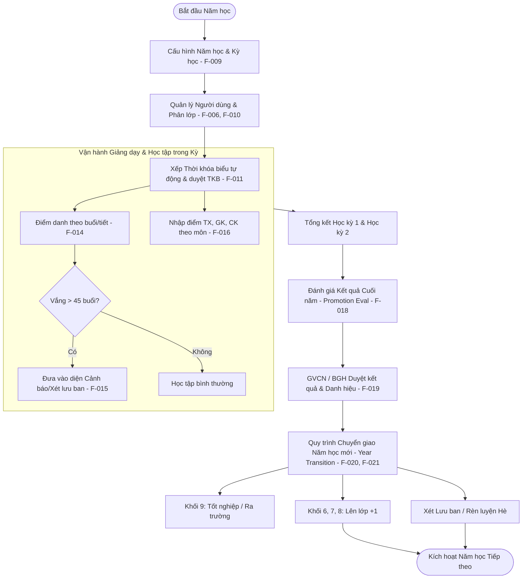

---

# 5. Phân tích Flow theo từng Module

## Module 1: Authentication & Authorization

### F-001 — User Login
- **Module**: Authentication
- **Actor**: Tất cả người dùng (Admin, GV, HS)
- **Trigger**: Người dùng nhập tên đăng nhập và mật khẩu tại màn hình `/login`
- **Preconditions**: Tài khoản đã được tạo và kích hoạt (`is_active = true`)
- **Flow Type**: Main Flow
- **Steps**:
  1. Người dùng truy cập trang `/login`.
  2. Nhập `username` (hoặc email/mã HS/mã GV) và `password`.
  3. Bấm nút "Đăng nhập".
  4. Hệ thống kiểm tra hợp lệ client-side (Zod schema).
  5. Gửi yêu cầu `POST /api/auth/login`.
  6. Backend truy vấn người dùng, kiểm tra `is_active`, giải mã mật khẩu với bcrypt.
  7. Sinh JWT Token có thời hạn kèm claims (user_id, role_id, permissions).
  8. Ghi nhận Security Log (`LOGIN_SUCCESS`).
  9. Phản hồi 200 OK kèm Token và thông tin User.
  10. Client lưu Token vào localStorage / Cookie và chuyển hướng vào `/dashboard`.
- **Postconditions**: Người dùng đăng nhập thành công, phiên làm việc được thiết lập.

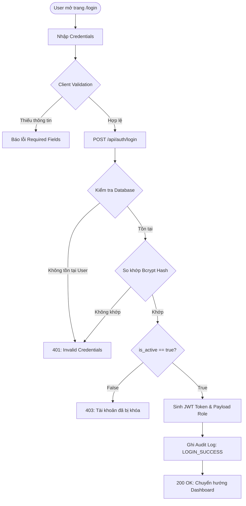

---

## Module 2: Timetable & Auto-Scheduling System

### F-011 — Auto-Schedule Generation (Xếp Thời Khóa Biểu Tự Động)
- **Module**: Timetable
- **Actor**: Admin / Quản vụ học vụ
- **Trigger**: Admin chọn Học kỳ và nhấn "Xếp TKB tự động" tại `/admin-timetable`.
- **Business Constraints**:
  1. Không bao giờ xếp 1 giáo viên dạy 2 lớp khác nhau trong cùng 1 tiết.
  2. Không bao giờ xếp 2 lớp vào cùng 1 phòng chuyên dụng (Tin học, Phòng Thí nghiệm, Âm nhạc) cùng 1 tiết.
  3. Phân tách môn KHTN thành các phân môn (Vật Lý, Hóa Học, Sinh Học) đảm bảo giáo viên bộ môn phụ trách đúng chuyên môn.
  4. Cân đối phân bổ tiết học: Không quá 3 tiết cho 1 môn/ngày, ưu tiên các môn Toán/Văn vào các tiết đầu buổi sáng.
- **Steps**:
  1. Admin chọn Năm học và Học kỳ cần xếp.
  2. Gửi request `POST /api/timetables/auto-generate`.
  3. Backend tải toàn bộ danh sách Lớp, Giáo viên, Môn học, Phòng học, Quy tắc phân phối tiết.
  4. Thuật toán khởi tạo ma trận lịch (Thứ 2 - Thứ 7, Tiết 1 - 10).
  5. Phân bổ tuần tự theo mức độ ưu tiên ràng buộc (Phòng chuyên dụng $\rightarrow$ Giáo viên thỉnh giảng/ít giờ $\rightarrow$ Môn chính $\rightarrow$ Môn phụ).
  6. Nếu phát hiện xung đột không thể giải quyết, áp dụng thuật toán Backtracking hoán đổi tiết.
  7. Trả về bảng TKB dự thảo (Draft Grid) hiển thị trực quan trên Client.
  8. Admin kiểm tra, điều chỉnh thủ công nếu cần và nhấn "Lưu chính thức".

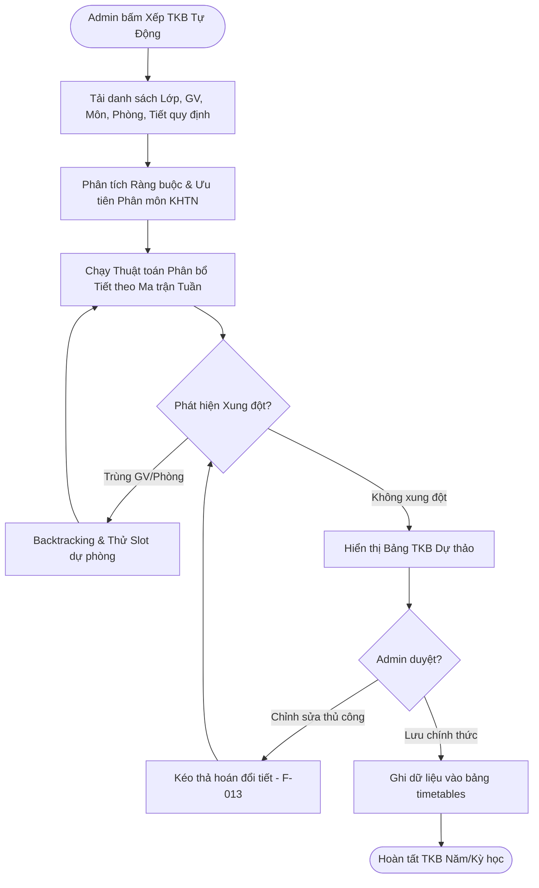

---

## Module 3: Attendance Tracking & Management

### F-014 & F-015 — Điểm danh buổi học & Cảnh báo giới hạn vắng
- **Module**: Attendance
- **Actor**: GVCN / Giáo viên bộ môn
- **Quy chế**: Tối đa vắng **45 buổi/năm** (Theo Quy chế THCS).
  - Vắng $\ge 40$ buổi: Cảnh báo vàng (`WARNING`).
  - Vắng $= 45$ buổi: Ngưỡng tới hạn (`AT_LIMIT`).
  - Vắng $> 45$ buổi: Vi phạm giới hạn (`EXCEEDED`), tự động chuyển sang diện xét lưu ban `PENDING_REVIEW`.

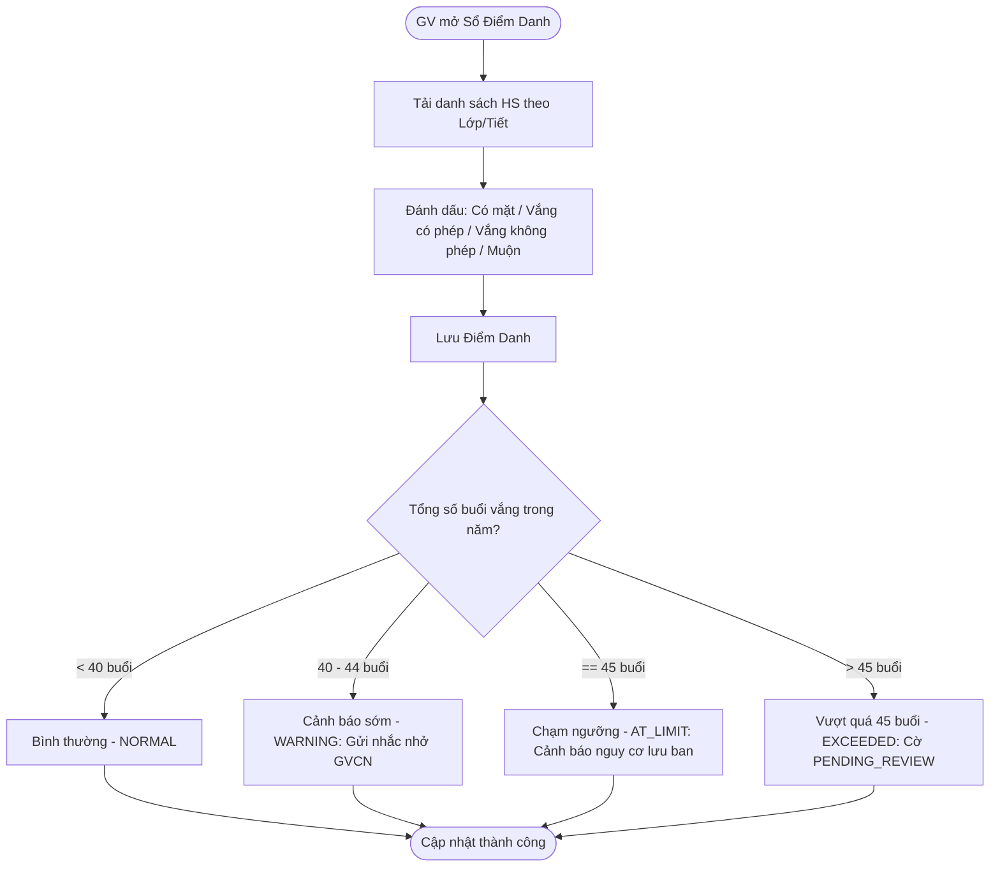

---

## Module 4: Grade Management & Gradebook (Sổ Điểm)

### F-016 & F-017 — Nhập & Tính Điểm Học Kỳ & Cả Năm
- **Hệ số tính điểm**:
  - Điểm Thường xuyên (TX): Hệ số 1.
  - Điểm Giữa kỳ (GK): Hệ số 2.
  - Điểm Cuối kỳ (CK): Hệ số 3.
- **Môn Đánh giá (Đạt / Chưa đạt)**: Giáo dục thể chất, Nghệ thuật, Hoạt động trải nghiệm... không tính điểm số vào ĐTB.

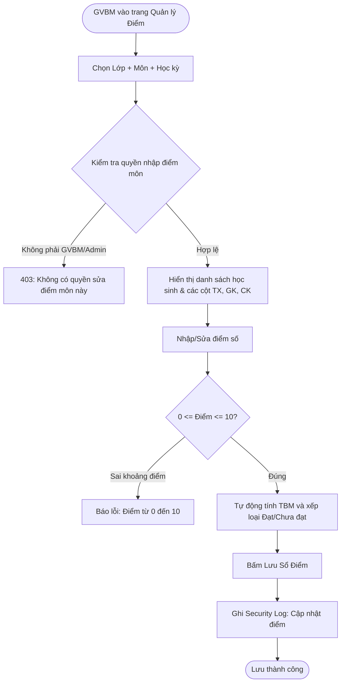

---

## Module 5: Promotion Evaluation & Year Transition (Xét Lên Lớp & Chuyển Năm)

### F-018, F-020, F-021 — Đánh giá Cuối năm & Wizard Chuyển Năm Học

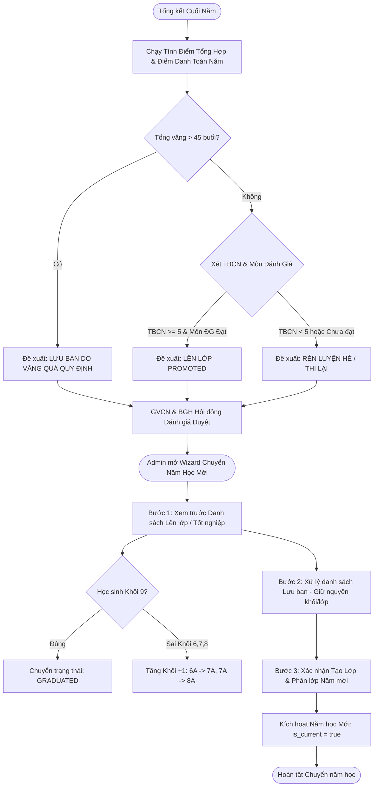

---

# 6. State Diagrams (Vòng Đời Trạng Thái)

### 6.1. Vòng đời Trạng thái Học sinh (Student Status Lifecycle)
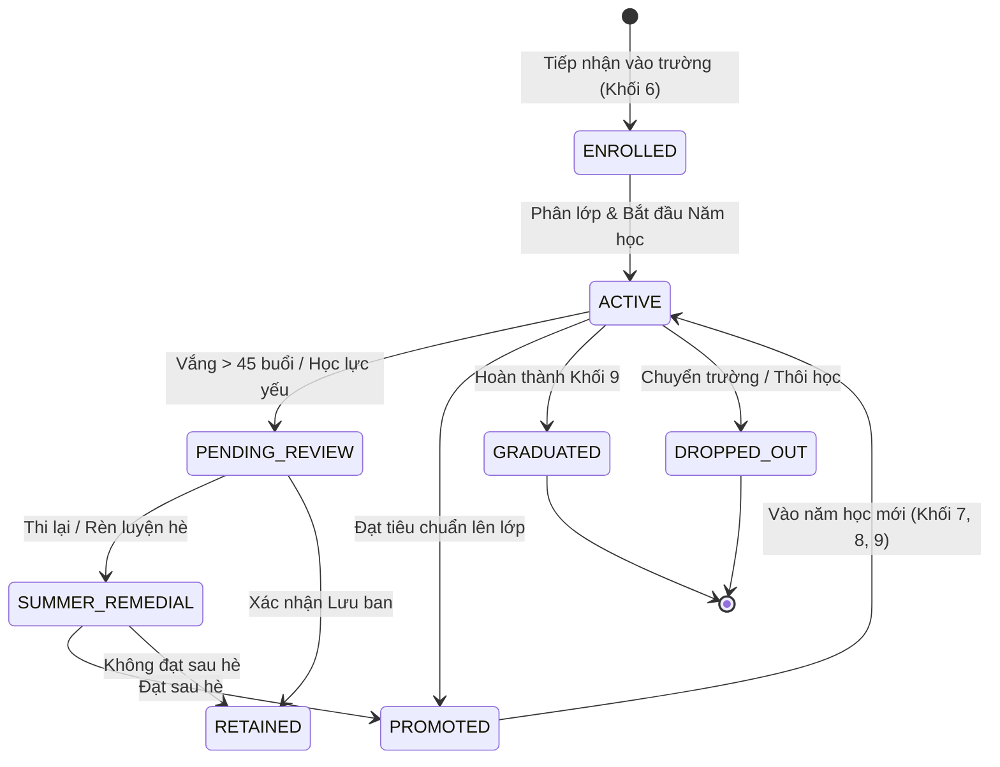

### 6.2. Vòng đời Kết quả Xét Lên Lớp (Year-End Evaluation Status)
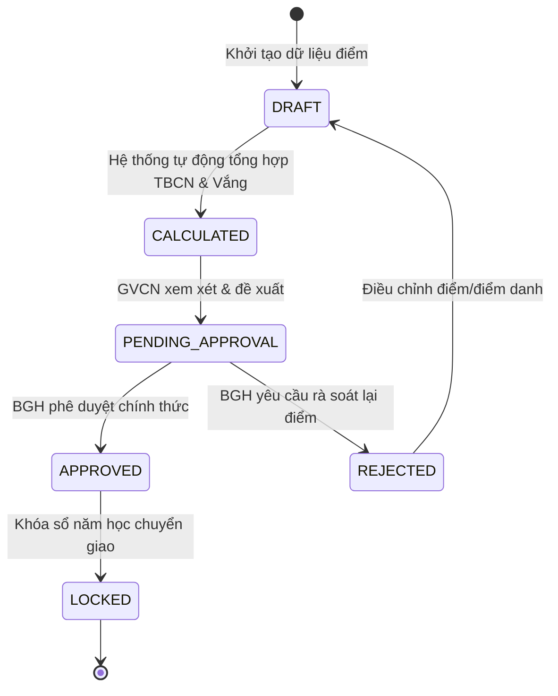

---

# 7. Sequence Diagrams (Các Luồng Kỹ Thuật Trọng Yếu)

### 7.1. Sequence: Đăng nhập & Xác thực JWT
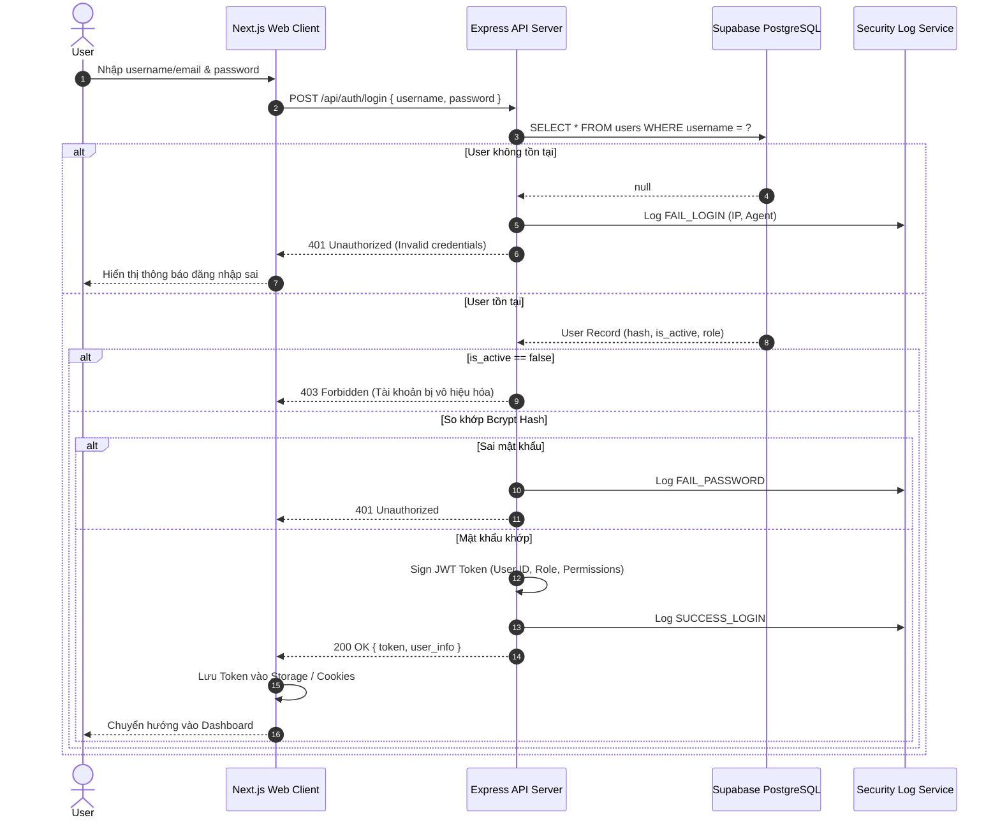

### 7.2. Sequence: Xếp Thời Khóa Biểu Tự Động
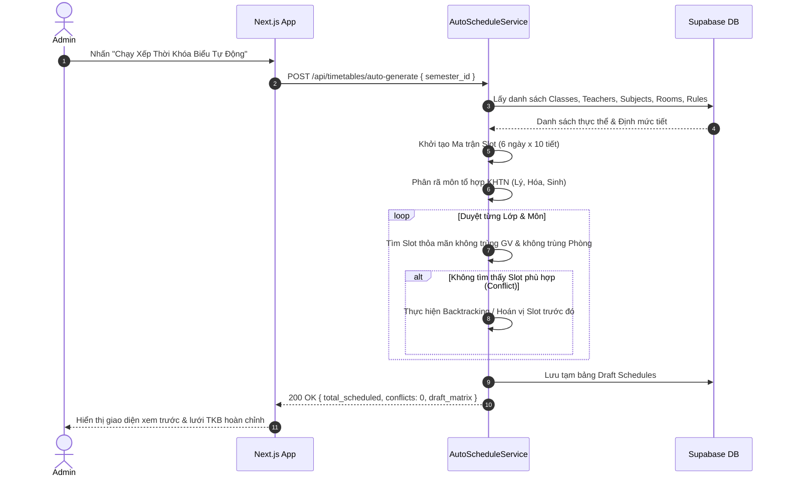

---

# 8. Integration Flows (Supabase & MCP Servers)

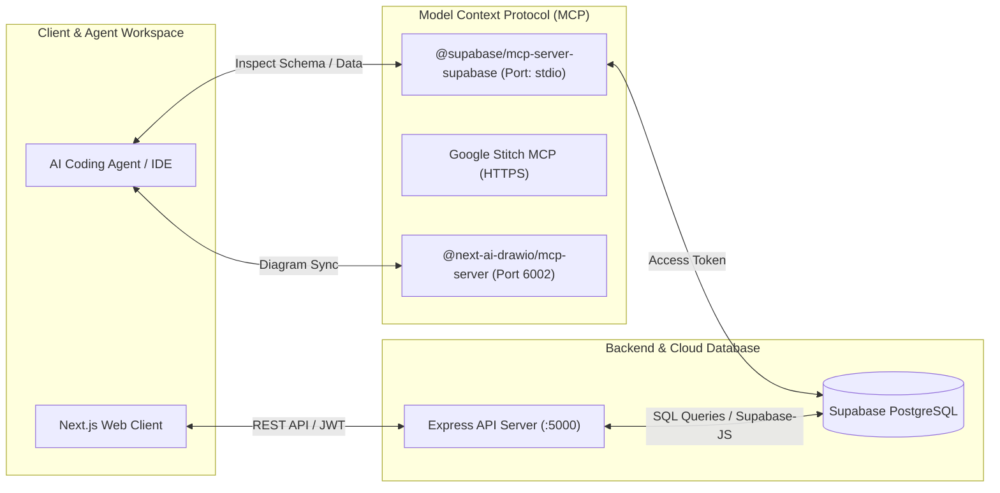

---

# 9. Background & Scheduled Flows

1. **Security Audit Cleanup & Archiving**:
   - **Trigger**: Hệ thống / Cron định kỳ.
   - **Process**: Quét bảng `security_logs`, nén log cũ hơn 180 ngày và lưu trữ phục vụ kiểm toán an toàn thông tin.
2. **Attendance Alert Threshold Engine**:
   - **Trigger**: Mỗi khi GV hoàn tất buổi điểm danh (`POST /api/attendance`).
   - **Process**: Đếm tổng số buổi vắng trong năm của học sinh. Nếu $\ge 40$ buổi gửi cảnh báo sớm, nếu $> 45$ buổi tự động kích hoạt cờ `EXCEEDED_ABSENCE_LIMIT` và chuyển trạng thái sang `PENDING_REVIEW` cho hội đồng cuối năm.

---

# 10. Error & Exception Handling Matrix

| Mã lỗi | Tình huống | Cách hệ thống xử lý | Giao diện hiển thị | Recovery / Retry |
| :--- | :--- | :--- | :--- | :--- |
| **ERR-401** | Token hết hạn / Không có token | Chặn tại auth middleware | Chuyển hướng về `/login` với thông báo "Phiên làm việc hết hạn" | Đăng nhập lại |
| **ERR-403** | Không đủ quyền (RBAC) | Chặn tại permission middleware | Toast: "Bạn không có quyền thực hiện hành động này" | Liên hệ Quản trị viên cấp quyền |
| **ERR-409** | Trùng lịch TKB / Trùng mã HS | Rollback giao dịch cơ sở dữ liệu | Cảnh báo chi tiết vị trí xung đột (GV/Phòng) | Đổi giáo viên hoặc chọn khung giờ khác |
| **ERR-422** | Nhập điểm sai khoảng (vd: 12đ) | Zod validator chặn tại Gateway | Highlight ô điểm màu đỏ: "Điểm từ 0 đến 10" | Nhập lại giá trị hợp lệ |
| **ERR-500** | Lỗi DB / Mất kết nối Supabase | Log stacktrace vào Security logs | Toast: "Lỗi kết nối máy chủ, vui lòng thử lại" | Tự động retry hoặc kiểm tra Internet |

---

# 11. Flow Coverage Matrix

| Module | Feature | Main | Alt | Validation | Error | Permission | Background/State |
| :--- | :--- | :---: | :---: | :---: | :---: | :---: | :---: |
| **Auth** | Đăng nhập, Token, Khóa TK | ✓ (F-001) | ✓ (F-005) | ✓ (F-002) | ✓ (F-004) | ✓ (F-003) | ✓ (Security Log) |
| **User Mgmt** | CRUD User, GV, HS | ✓ (F-006) | ✓ (F-008) | ✓ (F-007) | ✓ | ✓ | ✓ |
| **Academic** | Năm học, Lớp, Phân phòng | ✓ (F-009) | ✓ (F-010) | ✓ | ✓ | ✓ | ✓ |
| **Timetable** | Xếp TKB tự động & Thủ công | ✓ (F-011) | ✓ (F-013) | ✓ | ✓ (F-012) | ✓ | ✓ (Conflict Resolver)|
| **Attendance** | Điểm danh & Cảnh báo vắng | ✓ (F-014) | ✓ | ✓ | ✓ | ✓ | ✓ (F-015 Cảnh báo 45 buổi)|
| **Gradebook** | Nhập điểm, Tính TBM, TBCN | ✓ (F-016) | ✓ | ✓ (F-017) | ✓ | ✓ | ✓ (Auto-calculate) |
| **Year End** | Xét lên lớp & Chuyển giao năm | ✓ (F-020) | ✓ (F-019) | ✓ | ✓ | ✓ (F-021) | ✓ (State Transition)|
| **Security** | Phân quyền RBAC & Audit Log | ✓ (F-022) | ✓ | ✓ | ✓ | ✓ | ✓ (F-023 Audit Trail)|

---

# 12. Flow Gap Analysis & Open Questions

### Gap Analysis
- ✅ Toàn bộ các luồng cốt lõi từ Authentication, CRUD, Timetable, Gradebook đến Year Transition đã được bao phủ đầy đủ cả Happy Path và Edge cases.
- 💡 **Phân quyền đa cấp**: Quy chế xét lên lớp được thiết kế an toàn với cơ chế **Human-in-the-loop** (Hệ thống chỉ đề xuất `system_recommendation`, BGH/GVCN giữ quyền quyết định cuối cùng `final_result`).

### Open Questions / Recommendations
1. **Password Reset / Quên mật khẩu**: Hiện tại hệ thống đang dựa vào Admin để reset mật khẩu trong trang User Management. Có thể bổ sung luồng gửi OTP qua Email/SMS nếu nhà trường yêu cầu tự phục hồi mật khẩu.
2. **Xuất Báo cáo PDF**: Có thể bổ sung thêm luồng Export PDF Sổ học bạ điện tử theo mẫu chuẩn của Bộ Giáo dục & Đào tạo.
